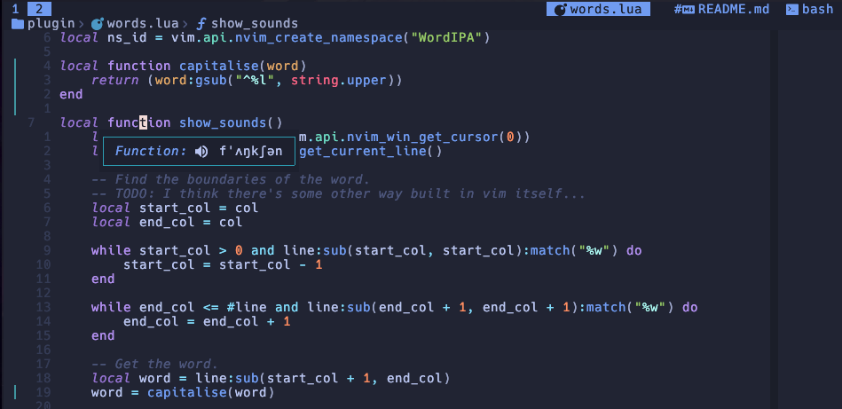
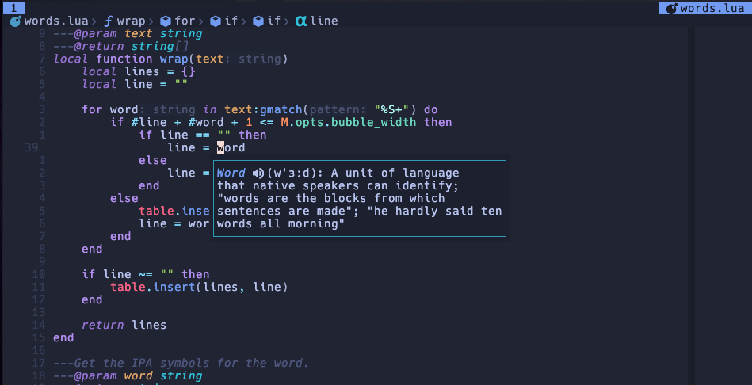

# Nvim-Words

A Neovim plugin to learn the pronunciation and definition of words.

_Show the pronunciation of a word:_

_Also show its meaning:_

TODO:

- [x] Show the pronunciation of the word under the cursor with IPA symbols.
- [ ] Show the pronunciation of the sentence under the cursor.
- [x] Show the definition of the word under the cursor.
- [x] Use a floating window instead of messages.
- [ ] Handle other languages besides English.
- [ ] Add the option to play sound.
    - [] Leverage **eSpeak/eSpeak NG** options to select voice, speed, non-IPA symbols, etc.
- [ ] Add `checkhealth` for dependencies.
- [ ] Setup function with options (optional keymaps).
- [ ] Visual selection to capture several words, sentences, paragraphs, etc.
    - [ ] Maybe use vim motions! _(i.e. pronounce 'a word')_
- [ ] Leverage dictionary options.
- [ ] Open multiple or long definitions in a split window.

FIX:

- [x] Better column count (don't just #text)
